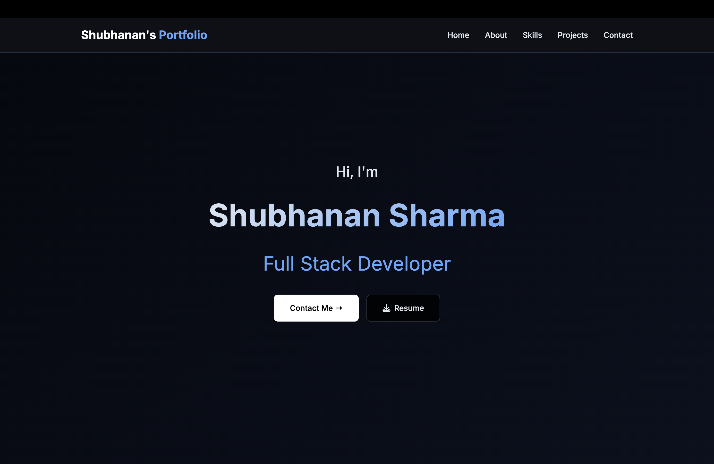

# 🚀 Shubhanan's Portfolio

A modern, responsive portfolio website built with Django, showcasing my journey as a Full Stack Developer and AI/ML enthusiast.



## 🌟 Features

- **Responsive Design** - Looks great on all devices
- **Modern UI/UX** - Clean, professional design with smooth animations
- **Interactive Contact Form** - Direct messaging capability
- **Project Showcase** - Detailed project cards with live demos and source code
- **Skills Section** - Visual representation of technical skills
- **Smooth Navigation** - Single-page application with smooth scrolling
- **SEO Optimized** - Meta tags and semantic HTML structure

## 🛠️ Tech Stack

**Backend:**

- Django 4.2+
- Python 3.11
- SQLite (Development)

**Frontend:**

- HTML5
- CSS3 (Custom styling)
- JavaScript (ES6+)
- Font Awesome Icons

**Deployment:**

- Gunicorn (WSGI Server)
- WhiteNoise (Static Files)
- Railway/Render/PythonAnywhere

## 🎯 Sections

1. **Hero Section** - Introduction with CTA buttons
2. **About Me** - Personal background and education
3. **Skills** - Technical skills with proficiency levels
4. **Projects** - Featured projects with descriptions and links
5. **Contact** - Contact form and social links

## 🏃‍♂️ Quick Start

### Prerequisites

- Python 3.11+
- pip
- Git

### Installation

1. **Clone the repository**

   ```bash
   git clone https://github.com/shubhs27/Portfolio-Django.git
   cd portfolio
   ```

2. **Create virtual environment**

   ```bash
   python -m venv venv
   source venv/bin/activate  # On Windows: venv\Scripts\activate
   ```

3. **Install dependencies**

   ```bash
   pip install -r requirements.txt
   ```

4. **Run migrations**

   ```bash
   python manage.py migrate
   ```

5. **Collect static files**

   ```bash
   python manage.py collectstatic --noinput
   ```

6. **Start development server**

   ```bash
   python manage.py runserver
   ```

7. **Open in browser**
   ```
   http://127.0.0.1:8000
   ```

## 📁 Project Structure

```
portfolio/
├── portfolio/
│   ├── __init__.py
│   ├── settings.py
│   ├── settings_prod.py
│   ├── urls.py
│   └── wsgi.py
├── Base/
│   ├── templates/
│   │   └── index.html
│   ├── views.py
│   ├── models.py
│   └── urls.py
├── static/
│   ├── css/
│   │   └── style.css
│   ├── images/
│   └── pdf/
│       └── resume.pdf
├── manage.py
├── requirements.txt
├── Procfile
├── runtime.txt
├── .gitignore
└── README.md
```

## 🔧 Configuration

### Static Files

Static files are handled by WhiteNoise in production. Make sure to run:

```bash
python manage.py collectstatic --noinput
```

## 📱 Responsive Design

The portfolio is fully responsive and tested on:

- ✅ Desktop (1920px+)
- ✅ Laptop (1024px - 1919px)
- ✅ Tablet (768px - 1023px)
- ✅ Mobile (320px - 767px)

## 📊 Performance

- **Lighthouse Score:** 95+ (Performance, Accessibility, SEO)
- **Load Time:** < 2 seconds on 3G
- **Optimizations:**
  - Compressed images
  - Minified CSS/JS
  - Efficient database queries
  - CDN for Font Awesome

## 📄 License

This project is open source and available under the [MIT License](LICENSE).

## 🙏 Acknowledgments

- Font Awesome for icons
- Django community for the amazing framework

---


